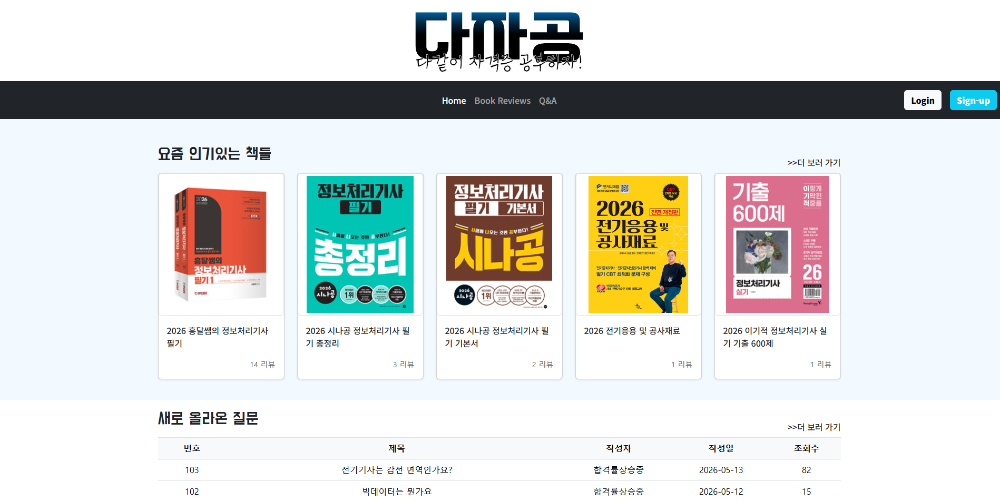
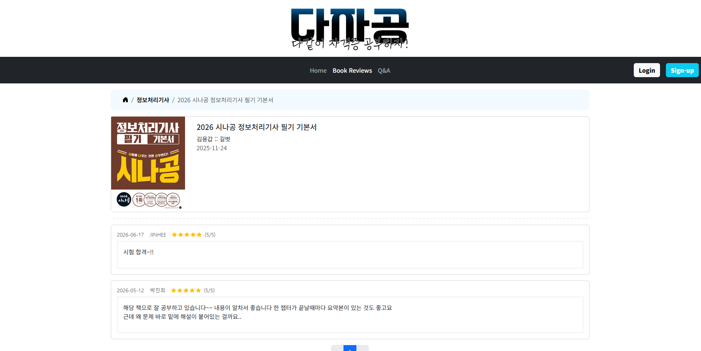
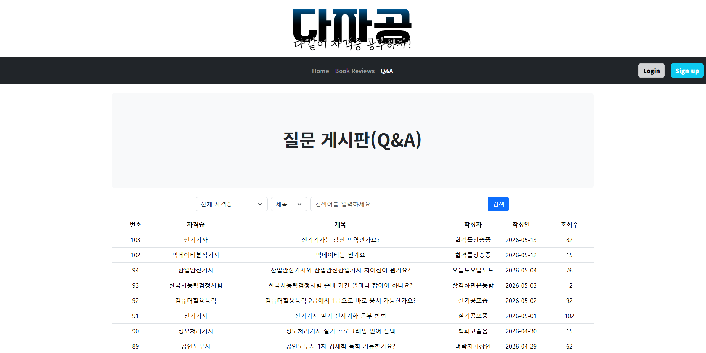
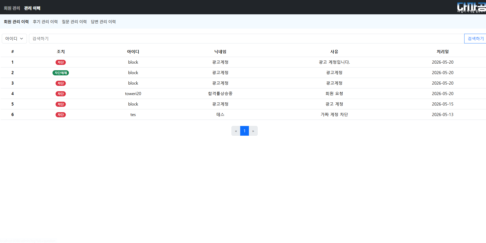

<div align="center">

# 다자공 (다함께 자격증 공부하자!)

**자격증 시험을 준비하는 사람들을 위한 통합 플랫폼**

KH 정보교육원 세미 프로젝트 (3인 팀)

</div>

---

## 프로젝트 소개

**다자공**은 자격증을 준비하는 사람들이 참고서적 리뷰를 공유하고, 질문/답변으로 서로 도움을 주고받을 수 있는 커뮤니티 플랫폼입니다.

- **개발 형태** : KH 정보교육원 세미 프로젝트
- **인원** : 3인

---

## Collaborators

| 이름 | 역할 |
|---|---|
| 박진희 | 팀장 · 책 리뷰 페이지 · 관리자 페이지 |
| 김은호 | 로그인 · 회원가입 · 마이페이지 |
| 한수열 | QnA 페이지 |

---

## Stacks

### Backend


### Frontend


### Tools


---

## 주요 기능

| 도메인 | 설명 |
|---|---|
| 회원 | 로그인, 회원가입, 마이페이지 |
| 책 리뷰 | 자격증 참고서적 리뷰 작성/조회 |
| QnA | 자격증 관련 질문/답변 게시판 |
| 관리자 | 회원 활동(질문·답변·리뷰) 관리, 관리 이력(ManagementHistory) 기록 |

---

## 프로젝트 구조

```
dajagong/
├── src/main/java/kh/dajagong/
│   ├── user/         # 로그인 · 회원가입 · 마이페이지
│   ├── book/review/     # 책 리뷰
│   ├── qa/          # 질문/답변
│   ├── admin/         # 관리자 · 관리 이력
│   └── common/        # 공통 설정 · 예외 처리 · 페이징
├── src/main/resources/
│   ├── mappers/        # MyBatis XML 매퍼
│   ├── templates/       # Thymeleaf 뷰
│   └── application.properties
└── database/          # DB 관련 문서
```

각 도메인 패키지는 `controller / service / mapper / model(vo)` 계층으로 구성되어 있습니다.

---

## Screenshots

| 메인 | 책 리뷰 상세 |
|---|---|
|  |  |

| QnA | 관리자 · 관리 이력 |
|---|---|
|  |  |

---
